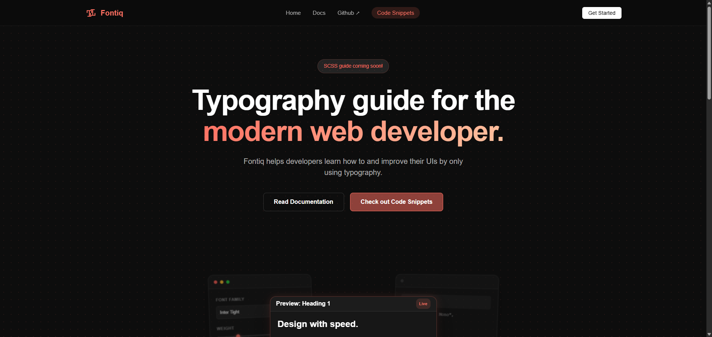

 
 

 

 

 
# ~ [Fontiq](https://fontiq.vercel.app/) ~
Fontiq is a modern typography guide and code-snippet hub built for developers and designers who care about clean, readable UI.
 
### Why Fontiq?
Most typography resources are bloated or outdated. Fontiq stays practical: real rules, real examples, copy-paste snippets.
- Typography principles (clear, modern, usable) 🔥
- Ready-to-use CSS snippets 🔥
- Beginner-friendly, still useful for pros 🔥
- Fast, no clutter, no nonsense 🔥

## Contributing
PRs, suggestions, and bug reports are welcome!  
Please fork the repo, create a branch, and submit a pull request.

### Roadmap / Future
- Add more code snippets 🔥
- Community contributions / PRs
- Advanced typography guides

Have fun with Fontiq!
